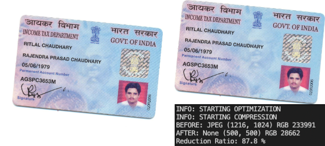
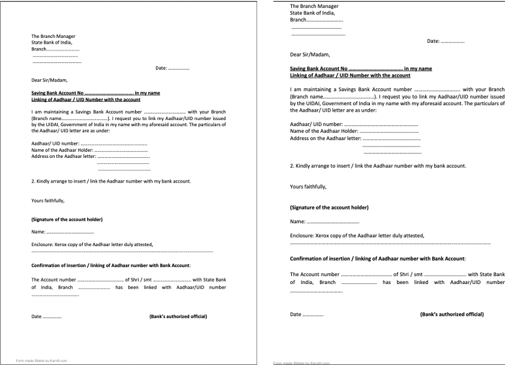

# [SBI - Image Document Optimization](https://www.techgig.com/hackathon/image-document-optimization)

## Objective
```
Documents are used during the process of daily operations and are stored as image files or in PDF.
The documents can be of varied types such as:
    Application forms
    Customer Request forms
    Account Opening Forms
    KYC Documents
    Agreements
    Reports
    Certificates
    Confidential Reports
    Account Statements
    Varied document formats including OVDs

A Huge volume of documents need to be maintained, re-used, preserved for operational activities during the Loan & Deposit Account lifecycle. Optimization is required for these documents to help efficiently store / retrieve the documents.
```

## Solution Expected:
```
Optimisation of captured documents that are stored as images / PDF files.

The following are the expectations from the prototype:
    Document / Image can be:
    Standardised KYC
    Structured Document
    Unstructured documents

To optimise document / image by:
    Reducing Size
    Eliminate / reduce Whitespace
    Optimise alignment of document
    Orient & Center document text
```
## Solution Architecture


## Solution Samples
## Images
### Sample - 1


### Sample - 2 


### Sample - 3
#### Key Points

#### Output


## Pdfs
### Sample - 1


### Sample - 2 

