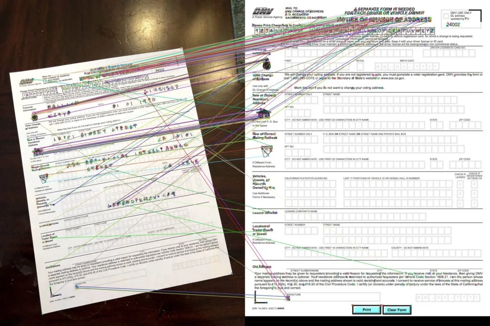

# [SBI - Image Document Optimization](https://www.techgig.com/hackathon/image-document-optimization) - Idea submission

## Objective
```
Documents are used during the process of daily operations and are stored as image files or in PDF.
The documents can be of varied types such as:
    Application forms
    Customer Request forms
    Account Opening Forms
    KYC Documents
    Agreements
    Reports
    Certificates
    Confidential Reports
    Account Statements
    Varied document formats including OVDs

A Huge volume of documents need to be maintained, re-used, preserved for operational activities during the Loan & Deposit Account lifecycle. Optimization is required for these documents to help efficiently store / retrieve the documents.

Solution Expected:
Optimisation of captured documents that are stored as images / PDF files.

The following are the expectations from the prototype:
    Document / Image can be:
    Standardised KYC
    Structured Document
    Unstructured documents

To optimise document / image by:
    Reducing Size
    Eliminate / reduce Whitespace
    Optimise alignment of document
    Orient & Center document text
```

## Solution Proposed (POC)
```
The idea is to use the following:

- The cognitive services to extract information from teh document (Azure Computer Vision)
- Custom model to optimize documents

The FLow of Processing:

1. The flow starts with the user uoploading the document for optimization.
2. Once a new document is uploaded (synchronized) in Azure Blob Storage, it shall be immediately processed.
3. Azure Blob storage has a trigger that executes a simple Azure function that sends the message to Azure Queue
4. Azure Queue has a trigger that executes an advanced Azure function that 
    1) retrieves document from a blob storage account 
    2) optimize document by calling the custom model 
    3) writes results to an Azure storage
```

## Output Samples (POC)

### Document alignmnet by feature meatching


### Document White space reduction


### Document compression
